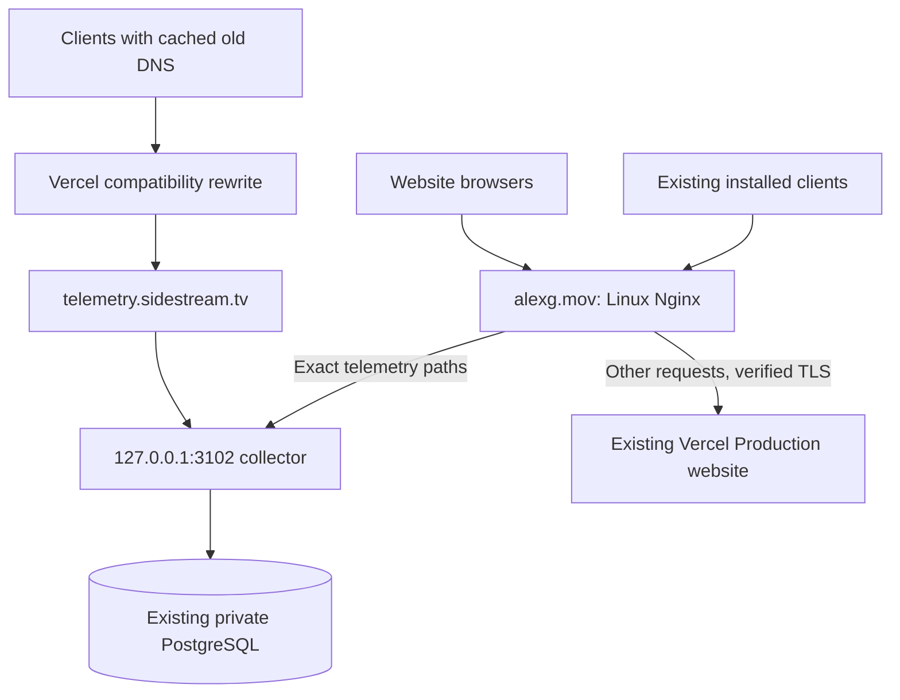

# Existing-client telemetry: alexg.mov ingress cutover

## Scope and source provenance

September 15, 2026 UTC: Linux terminates the unchanged old-client telemetry URL.
This is a hostname ingress migration, not a database or application release.

- Website infrastructure source: clean synchronized Sidestream Website `main`;
  the five `ops/nginx/alexg*` files are the installed configuration sources.
  Changes publish only through a scoped `main:main` push.
- Portfolio website source: **existing deployed bytes**, not its dirty checkout.
  Vercel's Production overview identified deployment
  `Dihh2bivfgEFoAgQguFsQGmKhZxQ`, hostname
  `alexg-kz4aidgaw-alex-3685s-projects.vercel.app`, displayed as a CLI deployment.
  No Git SHA is inferred for that deployment. Its assigned Production domains
  include `alexg.mov`, `www.alexg.mov`, and `alexgmov.vercel.app`.
- Anonymous canonical and project-alias requests returned the same homepage.
  No bypass credential or weakened deployment protection is needed.
- Vercel route `58fa58be-82cf-4a74-b764-1c64102be129` remains enabled, named
  **Sidestream telemetry direct Linux compatibility proxy**, with exact pattern
  `^/api/plugin-telemetry/?$` and destination
  `https://telemetry.sidestream.tv/v1/events`. No route change was made.
- Portfolio and FlowState edits were preserved. No extension packages,
  database/schema changes, provider changes, or service restarts were performed.
  Only Nginx was gracefully reloaded.

## DNS and TLS

GoDaddy inventory contained 21 records before certificate validation: one apex
A; two NS; `pay`, `www`, and `_domainconnect` CNAMEs; SOA; five Google MX records;
SES `send` MX; and Google verification, SPF, DKIM and DMARC TXT records. There
were no AAAA records. Mail and unrelated records were not edited.

| Record | Before | After |
| --- | --- | --- |
| `alexg.mov` A | `216.198.79.1`, TTL 600 | `2.29.9.121`, TTL 600 |
| `www` CNAME | `21c71053678bfaaf.vercel-dns-017.com.`, TTL 3600 | `alexg.mov.`, TTL 3600 |

Changes were saved around 18:56 UTC. Both `ns57.domaincontrol.com` and
`ns58.domaincontrol.com`, plus `1.1.1.1` and `8.8.8.8`, returned the new records
at 18:56:41 UTC. Cached old answers remain valid during propagation; keep the
old Vercel route/deployment/domain in place. Apex and www both continue serving
the website rather than introducing a new canonical redirect. HTTP retains
308 HTTPS redirects with the complete original query string.

A Let's Encrypt certificate for both names was obtained through DNS validation
**before** customer DNS changed. It expires December 14, 2026, and is installed
at `/etc/letsencrypt/live/alexg.mov/`. Certbot was then reconfigured with webroot
`/var/www/certbot` and `--preferred-challenges http`; the renewal simulation
succeeded. Its original manual DNS preference must not be retained when using
the webroot authenticator. The scoped `alexg-reload` deploy hook validates
Nginx and gracefully reloads it. Other certificate hooks are unchanged.

HTTP ACME requests first serve local tokens, then fall back to the Vercel
upstream on port 80 for Vercel's own HTTP-01 domain validation. This explicit
challenge-only upstream preserves HTTP end to end. All `/.well-known/vercel/*`
requests remain uncached through the website proxy. Keep upstream certificates
valid as well as the public Linux certificate; never disable TLS verification.
The two temporary `_acme-challenge` TXT records were removed after issuance
and successful webroot renewal qualification; GoDaddy returned to 21 records.

## Installed routing and safeguards

| Repository file under `ops/nginx/` | Server destination |
| --- | --- |
| `alexg.mov.conf` | `/etc/nginx/sites-available/alexg.mov`, enabled by symlink |
| `alexg-vercel-upstream.conf` | `/etc/nginx/conf.d/alexg-vercel-upstream.conf` |
| `alexg-vercel-proxy.conf` | `/etc/nginx/snippets/alexg-vercel-proxy.conf` |
| `alexg-legacy-telemetry.conf` | `/etc/nginx/snippets/alexg-legacy-telemetry.conf` |
| `alexg-cert-renewal.sh` | `/etc/letsencrypt/renewal-hooks/deploy/alexg-reload` |

The upstream resolves Vercel's assigned DNS target
`21c71053678bfaaf.vercel-dns-017.com`, never `alexg.mov` or `www.alexg.mov`.
The Linux system resolver refreshes its addresses; no deployment hostname or
fixed Vercel IP is pinned. Host and TLS SNI remain the original allowed hostname.
Apex and www have separate connection/TLS pools: sharing a pool initially
produced a www 502 during preflight; separate pools passed alternating-host
tests. Upstream certificates are verified against the system CA bundle.

Telemetry has two exact locations, each using the same local proxy snippet.
Only POST/OPTIONS are accepted, body limit is 512 KiB, and the existing request
and connection limit zones are reused. Incoming request headers are discarded
except the explicit content type, user agent and Origin; trusted forwarding
headers are reconstructed and the existing root-only origin-auth snippet is
included. Client-supplied origin-auth is never trusted. Cache and upstream
retries are off. Collector errors are passed through, never rewritten to success.
Legacy HSTS, no-sniff, no-referrer and no-store response headers are retained.

Other website requests retain method, raw body, path/query, cookies,
authorization, content type, response cookies, redirects and cache headers.
Nginx adds no response cache, does not rewrite redirects, and streams large
responses without a second disk cache. Forwarding headers are reconstructed;
forged internal-auth and recognized alternate client-IP/bypass headers are
removed. Website per-IP limits are 50 requests/second with a 200-request burst
and 50 concurrent connections. Website body limit is 4500 KiB; telemetry keeps
its stricter limit. No internal Linux API or filesystem route is exposed.

Vercel sees the Linux IP for website traffic, so its IP/geolocation reporting
and IP-based defenses do not retain original-client fidelity. Sidestream's
separate hostname, regional pricing, authentication, and checkout routing are
unchanged. Do not forge a trusted CDN header to circumvent that limitation.
See [Vercel's proxy requirements](https://vercel.com/kb/guide/can-i-use-a-proxy-on-top-of-my-vercel-deployment)
and [verified proxy limits](https://vercel.com/kb/guide/how-to-setup-verified-proxy).

## Validation evidence

Preflight used `curl --resolve` with normal certificate verification, before
DNS cutover. Public tests used public DNS, including Cloudflare DNS-over-HTTPS
while local resolver caches still held the old address; the actual connected
peer was recorded separately. A successful response from the old address is
compatibility evidence, not bypass evidence.

| Surface | Result |
| --- | --- |
| Nginx | Validation passed before each graceful reload; existing unrelated proxy-header hash warnings remain |
| Apex/www | Repeated alternating-host requests 200; identical homepage, no TLS bypass |
| Homepage, portfolio, LUT detail, install-guide query navigation | Identical HTML bytes; browser homepage and portfolio navigation rendered |
| JS/CSS | Current index, vendor, and stylesheet bytes identical |
| Homepage video | Full 1,823,671-byte response identical; bytes 100–199 returned 206 and exactly 100 bytes |
| Portfolio video | Full 6,569,919-byte response identical |
| Legacy Mac and Windows manifests | Both 200 with identical validated manifest bodies, not redirects |
| Portfolio checkout | Safe MERIDIAN initiation returned 200 with a Stripe-hosted Checkout URL; no payment submitted |
| Cookies | Same analytics cookie attributes; replayed visitor/session cookies were accepted without replacement |
| Legacy free download | Same 302 to `sidestream-xi.vercel.app/api/download`, no-store preserved |
| Invalid/missing/expired download credentials | Existing 400/410 behavior retained; no customer signed link exposed |
| Webhook | Unsigned JSON rejected with matching 400 response; no fulfillment, payments or email generated |
| Sidestream Unlimited start | GET 302 directly to canonical Google authentication |
| Telemetry POST/OPTIONS, both forms | 200 strict Postgres acknowledgement / 204 wildcard CORS |
| Telemetry boundaries | GET 405, malformed JSON 400, 524,289-byte body 413; private/nonexact paths 404 |
| Forged origin-auth header | Valid event still recorded through server-injected authentication |
| Upstream unavailable | Isolated loopback Nginx fixture returned 502; production collector stayed running |

Preflight probes persisted once each after duplicate submissions:

- `operator-legacy-cutover-1ea293ca-7d1d-48c5-adf1-553221c28735`
- `operator-legacy-cutover-87e69934-246a-4df5-a167-8f4c20325b54`

Public-DNS POSTs connected to `2.29.9.121`, acknowledged `accepted:1`,
`recorded:1`, `collector:postgres`, and bounded PostgreSQL queries confirmed
exactly one row after retries for each:

- `operator-public-linux-9751e112-acee-46b5-82cf-28b35f9a466d`
- `operator-public-linux-ea195d6b-5f3f-46b9-abe0-7f4c85242f67`

These are explicitly synthetic operator events without install/session identity,
not customer downloads. At 18:58 UTC the privacy-safe Nginx ingress log contained
22 post-cutover telemetry requests, all with upstream `127.0.0.1:3102`
(21 responses 200, one 204). This pairs a public Linux peer with the actual
local upstream and database persistence; DNS or missing Vercel headers alone
are not the proof. Website requests in the same log use Vercel addresses.

Natural arrivals from 18:56 UTC through 18:57:56 UTC included 236 non-operator
events from 121 nonempty installation identities. This is an aggregate across
ingestion paths; the separate ingress log proves natural legacy requests are
also reaching the new Linux route.

By 19:01 UTC ordinary local resolution also connected to `2.29.9.121` without
DNS overrides. Both POST/OPTIONS forms passed again; the same two public probe
IDs still had exactly one row. Windows release metadata, invalid checkout and
webhook rejection, and the complete portfolio video also passed publicly.

Repository validation: `nginx -t` and the scoped renewal hook passed on Linux;
`sh -n`, `git diff --check`, `npm run verify:checkout-contract`,
`npm run test:entitlement` (32 passed), and `npm run build` passed locally.
The source guard requires equality with the remote SHA, so its remote-equality
check must also pass after the scoped main push. Canonical live version proof
remains a separate deployment gate.

Dashboard health retained `live/postgres/production` and refreshed successfully
at `2026-09-15T18:58:24.613Z`, with `last_refresh_failed:false`.
`/var/lib/nginx/proxy` remains `www-data:www-data`, mode `0700`. The dashboard
query repair and reader settings were not edited; no broad history queries or
analytics service restarts were used for this migration.

## Rollback

Root-only baseline: `/root/alexg-ingress-20260915/`, containing the complete
pre-change `nginx/`, original renewal configurations, installed source copies,
and the isolated failure fixture. Previous September 10 backups remain intact.

1. Restore only the GoDaddy apex A to `216.198.79.1` (TTL 600) and www CNAME to
   `21c71053678bfaaf.vercel-dns-017.com.` (TTL 3600). Do not edit MX/TXT or NS.
2. Keep the new Linux virtual host and certificate working while cached new DNS
   answers expire. Keep Vercel's current domain, deployment and exact telemetry
   rewrite enabled. Verify both telemetry forms and a persisted retry canary.
3. If Linux configuration itself needs rollback during propagation, restore a
   known-good **alexg ingress** configuration and validate/reload Nginx. Removing
   the new virtual host immediately would break clients caching the Linux IP.
4. Once no clients depend on the Linux hostname routing, the new symlink,
   snippets, upstream declarations and scoped renewal hook can be retired with
   `nginx -t` followed by a graceful reload. Do not restore the entire old Nginx
   directory over later unrelated changes.

No rollback reconnects Neon, changes databases, stops the collector/dashboard,
or publishes an extension package.

## Remaining dependencies and cost verification

Vercel still serves the portfolio frontend, commerce APIs, provider webhooks,
LUT Blob downloads, and the separate Sidestream website/API edge entry and
schedules. Its subscription remains. Website requests through Linux still
incur Vercel usage and add a network hop. Only legacy telemetry requests that
resolve to Linux bypass Vercel entirely.

Compare completed post-propagation UTC days with like-for-like prior days in
Vercel Usage, scoped to `alexg.mov`: edge requests and incoming/outgoing origin
transfer separately. Correlate with the privacy-safe Linux telemetry request
counts/statuses and aggregate event arrivals. Allow provider billing lag and
changing customer volume. Historical project-level transfer totals did not
prove route attribution and do not justify a guaranteed saving.

Use `/var/log/nginx/alexg-ingress.log` for bounded aggregate diagnostics. It logs
only time, route class, status, size, duration and upstream address/status—never
customer IPs, full URLs, queries, cookies or payloads. Avoid dumping `nginx -T`
or private runtime environment files because they include credentials.
