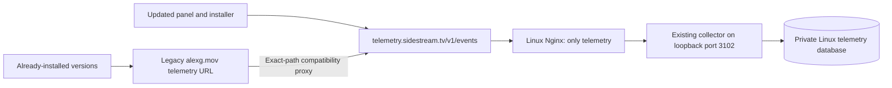

# Direct Linux telemetry ingress

## Status and scope

Prepared September 7, 2026; **not deployed**. SSH to `sidestream-server` still
fails authentication. The production recovery route documented in the README
remains active. DNS, certificates, Nginx, the collector service, and shipped
clients have not changed. Nginx is not installed locally and the local Docker
daemon is unavailable, so the prepared configuration has not passed `nginx -t`.

The first migration removes Vercel and the portfolio frontend from **new
telemetry traffic**. It reuses the existing Linux collector and telemetry
database: no new database, data migration, public PostgreSQL listener, or
replacement event-writing implementation. Website/account/payment routing is
outside this change.

The old URL necessarily stays available for installed versions with that URL
compiled into them. DNS cannot route only one path of `alexg.mov` to another
server. Initially that URL still passes through Vercel, but its exact-path
project rewrite should go directly to this new public ingress, with no database
handler, deployment-specific bridge, or automation-bypass credential. Removing
Vercel from those old requests entirely would require moving the whole
`alexg.mov` hostname or updating those clients; neither is needed for this step.

## Ownership and files

- This Website repository owns the infrastructure templates in
  `ops/nginx/telemetry.sidestream.tv*.conf` and
  `ops/nginx/sidestream-telemetry-limits.conf`.
- The portfolio repository continues to own `api/plugin-telemetry.js`,
  `lib/postgres-db.js`, and the existing Linux service. Its unrelated dirty
  checkout must not be deployed as part of this migration.
- FlowState owns the client defaults in `js/logger.js` and
  `scripts/build-mac-native-installer.sh`. Both currently point at
  `https://alexg.mov/api/plugin-telemetry`; both need the new HTTPS URL after
  server qualification. Preserve its unrelated logger changes. Test-channel
  behavior, endpoint overrides, disabled Test installer telemetry, privacy
  redaction, bounded queues, retries, and strict acknowledgements stay intact.

## Ingress contract

`telemetry.sidestream.tv` must resolve directly to the existing Linux server,
not to Vercel. Verify its live address before DNS changes; the documented server
is `2.29.9.121`. Add IPv6 only if routing, firewall, listener, and TLS are tested.

Nginx exposes only `POST /v1/events` and `OPTIONS /v1/events`, forwarding the
unaltered body to `http://127.0.0.1:3102/api/plugin-telemetry`. The collector
retains body/event validation, redaction, atomic deduplication and rollups, and
its full-persistence acknowledgement. Malformed input and database failures
must not be converted into successful acknowledgements.

The supplied configuration limits body size to the existing 512 KiB collector
limit, bounds connections/request rate, disables upstream retries/caching, and
logs operational metadata without identities or event bodies. Rate-limit
responses are retryable 429s; validate queue drain for a shared-IP test before
client rollout. CORS preflight continues through the existing collector.

Incoming internal-auth and forwarding headers are discarded. Nginx injects the
existing collector origin secret from a root-owned, mode-0600 local snippet at
`/etc/nginx/snippets/sidestream-telemetry-origin-auth.conf`. That snippet contains
only `proxy_set_header X-Sidestream-Origin-Auth` with a correctly Nginx-escaped
value. Obtain it locally from the running service's existing protected runtime
configuration; do not rotate it for this migration, print it, put it in shell
history/Git, or ship it to a client. Do not use `nginx -T` in captured output,
because that dumps included secrets. Missing snippet or certificate must fail
configuration validation before reload. All other paths return 404, and the
existing origin-authentication gate remains enabled for other APIs.

## Ordered activation and proof

1. With authenticated server access, attest the active Nginx configuration,
   service unit/runtime file, loopback collector on 3102, and private database.
   Save the current relevant configuration and recovery-route version for rollback.
2. Install the HTTP bootstrap virtual host and shared limit/log declarations.
   Validate with `nginx -t` before a graceful reload. Publish only the new DNS
   record, verify resolution, and obtain its TLS certificate using the existing
   ACME webroot workflow. This does not change existing hostnames.
3. Create the local secret include, install the TLS virtual host, run
   `nginx -t`, then gracefully reload Nginx. Do not restart the application or
   database. Check the new host independently before sending clients to it.
4. Verify OPTIONS/CORS, GET rejection, arbitrary/private-route 404s, oversized
   body rejection, forged internal-header replacement, and TLS. A valid unique
   synthetic operator event without installation/session identity must return
   `recorded: 1`, `collector: postgres`, and be read back from the Linux dataset
   using a bounded timestamp window. Repeat its ID and prove deduplication;
   never count a synthetic event as a customer download. Test upstream failure
   with a local isolated fixture, never by stopping the production collector.
5. Replace only the legacy exact-path Vercel project recovery rule's destination
   with `https://telemetry.sidestream.tv/v1/events`; remove its automation-bypass
   header and old destination-host condition. Stage and verify that legacy POST
   bodies, acknowledgements, CORS, and retries survive the rewrite, then publish.
   Do not redirect: installed clients need a direct successful response.
6. Prepare FlowState's endpoint-default change in its normal Test workflow,
   run focused telemetry checks and both required package preparations, then
   verify a loaded Test panel's real upload and a staged installer receipt.
   Production publication follows the existing explicit Test-to-Production
   release policy; do not silently release an extension with this server change.
7. Verify fresh natural events, a refreshed dashboard, unchanged website/sign-in
   and installer routes, and continued Neon isolation. Keep the legacy proxy
   while old clients remain; report new/direct and legacy paths separately.

## Rollback

Before client rollout, restore the saved legacy project route if the new
ingress fails. Preserve the current working deployment and its automation
credential until that bridge is retired after verification. Revert only the new
virtual host if needed, validate Nginx, and reload; leave the database and other
virtual hosts alone. Once clients use the new hostname, keep that hostname and
restore its last working ingress configuration rather than deleting DNS. No
rollback reconnects Neon. Missing historical telemetry is a separate recovery
question, not solved by moving the endpoint.
