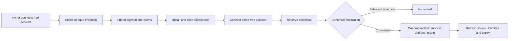

# Download friend rewards — v30 contract

Status: implementation and disposable-database qualification; not a shipped v30 release.
Marketing `referral-visits.ts` and `installer-referral.ts` remain attribution-only.
This program has no purchase discounts, coupons, affiliate identity or Stripe grants.

## Ownership and qualification

Website owns `api/_lib/download-referrals.ts`, the `api/download-referrals*`
routes, the additive `20260925120000_add_download_friend_rewards.sql` migration,
and reward qualification inside `finalizeDownloadCredits` in
`api/_lib/download-credits.ts`. FlowState owns the existing patterned invitation
card and `js/download-referrals.js` transport/credential controller.



A new friend means a verified Google account created after the invitation's
server-recorded first visit, plus an installation wallet created after that
visit with no imported or committed usage. Existing account/install identity
conflicts fail closed. The browser retains an opaque HttpOnly invitation cookie
for 30 days, so retrying the same invitation preserves its original visit through
OAuth. The authenticated account claim survives leaving the website, downloading
an unchanged standard installer, and connecting that account on first panel open.
No invitation is embedded into installer bytes. Use the same account on another
computer; the browser cookie is not entitlement proof.

A first successful, credential-bound reservation commit grants each account
exactly 720 hours (30 days). Each recipient has one durable claim per namespace;
unique `(claim_id, role)` and `(claim_id, account_id)` grant constraints prevent
repeat awards. Inviter expiry advances from `greatest(now(), current_expiry)`.
Failed/cancelled (`released`), expired, nonexistent, duplicate, and only-reserved
jobs never award. Both grants, expiry projections and successful finalization
commit together; any failure rolls all of them back for same-key retry.

The existing canonical finalizer is client-reported after successful local
delivery/import. This implementation authenticates and records that transition;
it does not introduce independent remote attestation of a file downloaded by CEP.
Rate limits and existing verified-account/device ownership are the abuse boundary.

## Durable records and access

All seven `sidestream_download_referral_*` tables are server-only with RLS and
revoked public/anon/authenticated access:

| Suffix | Ownership |
| --- | --- |
| `members` | Account, original Free wallet, stable random invite code, reward expiry projection |
| `visits` | Hashed opaque browser visit, inviter, 30-day expiry |
| `claims` | One recipient per namespace; inviter, qualification time and reservation key |
| `connections` | Separate hashed browser key and panel credential; 15-minute browser approval |
| `devices` | Immutable account ownership of the existing HMAC device identity; rotating 180-day credential |
| `grants` | Immutable 30-day award records, two per qualification |
| `downloads` | Zero-cost referral/verified-paid reservations, terminal outcomes and seven-day expiry |

Free credit reservations gain nullable `referral_account_id`; existing rows and
ledger balances are retained. Reconnecting/reinstalling under the same account
resolves the original wallet. Every connection, including an existing member
reconnecting, rejects device history belonging to another paid account. Connecting never grants starter credits. Paid
licenses, activation sessions, license credentials and Stripe state are untouched.
Active referral jobs have a separate zero-cost reservation and spend no Free
credits. The qualifying Free download spends its ordinary one download; subsequent
reward-covered downloads do not. Expiration resumes the retained balance.
Already-authorized paid downloads stay Unlimited after referral expiry.

A short namespace advisory lock precedes wallet locks in enabled credit and
referral transactions. It serializes claim/link/grant races with one consistent
order; there are no provider calls inside this lock. Measure contention before
broad rollout. Production and Test use the existing trusted license-environment
resolver, distinct hosts/databases, and namespace-scoped keys. `buildChannel`
and request bodies never select a namespace.

## API and extension integration

All responses are private/no-store. Tokens are opaque bearer credentials: never
log them, put panel credentials in browser URLs, or include them in telemetry.
The browser continuation carries a different one-use approval key. Stable invite
codes contain no account, email, installation, or reward identity.

| Route | Behavior |
| --- | --- |
| `GET /r/:code` | Temporary redirect to the canonical API invitation route |
| `GET /api/download-referrals/invite?code=…` | Validates invite, retains/mints visit, redirects to claim; no grant |
| `GET /api/download-referrals/claim?visit=…` | Ordinary Google authentication if needed, then explicit claim confirmation; no Checkout |
| `POST /api/download-referrals/claim?visit=…` | Signed-in, same-origin JSON claim; rejects old/self/replayed recipients |
| `POST /api/download-referrals` | Panel `status` or `connect`, scoped to existing `deviceId` |
| `GET /api/download-referrals/connect?key=…` | Google authentication then explicit installation/account confirmation |
| `POST /api/download-referrals/connect?key=…` | Signed-in, same-origin JSON binds panel credential to account/wallet |
| `POST /api/credits/sync`, `reserve`, `finalize` | Existing bodies plus optional `referralToken`; server verifies ownership and expiry |

Example panel requests (replace bracketed values with server-issued values):

```json
{"action":"connect","deviceId":"<persisted-device-id>"}
```

```json
{"state":"awaiting_connection","connectionToken":"<opaque-panel-credential>","connectUrl":"https://<channel-host>/api/download-referrals/connect?key=<separate-browser-key>","expiresAt":"2026-09-25T20:15:00.000Z","retryAfterSeconds":3}
```

Persist the connection token before opening the exact same-origin URL. Poll
`status` with `deviceId` and `referralToken` until `connected`; do not send a pending
credential to credits. The extension polls every ten seconds while connecting,
then once a minute. A reload retains the credential but always refreshes access.
It opens the existing invitation card once on first enabled launch to offer Free
account connection; all three approved entry points remain available thereafter.

```json
{"action":"status","deviceId":"<persisted-device-id>","referralToken":"<opaque-panel-credential>"}
```

```json
{"enabled":true,"state":"connected","acceptingInvitations":true,"invitationUrl":"https://<channel-host>/r/<32-character-code>","qualification":"awaiting_first_download","qualifiedAt":null,"reward":{"active":false,"expiresAt":null}}
```

`qualification` becomes `qualified` with a UTC `qualifiedAt` after success;
accounts without a claim return `not_claimed`. Reward states have independent
`active` and UTC `expiresAt`, retaining the past timestamp after expiry.
A disabled rollout returns `{ "enabled": false, "state": "disabled" }`.

```json
{"deviceId":"<persisted-device-id>","referralToken":"<opaque-panel-credential>","reservationKey":"credit-<48-hex-id>","formatType":"video"}
```

Reserve returns the existing balance/reservation fields. `creditCost: 0` means
a server-covered reservation; still finalize it. Paid clients optionally send
their existing `licenseToken` to reserve, which the server independently validates.
A body `paidAuthorized` value is ignored.

```json
{"deviceId":"<persisted-device-id>","referralToken":"<opaque-panel-credential>","reservationKey":"credit-<same-id>","outcome":"committed"}
```

Finalize uses only `committed` or `released`; it returns the existing fields plus
`referralReward: { "active": true, "expiresAt": "<UTC timestamp>" }` for a
connected wallet. Persist and replay the same finalization key on network loss.
Do not create a new key to retry a finished job. Referral display never changes
the client's paid-license state, and every download checks the server again.

| Status/code | Client action |
| --- | --- |
| 400 `referral_request_invalid` / `credit_request_invalid` | Correct the request; do not retry unchanged |
| 401 `referral_reconnect_required` | Reconnect the same account; keep queued finalizations |
| 401 `sign_in_required` | Refresh browser and sign in |
| 403 `origin_required` | Submit from the same-origin confirmation page |
| 404 `invitation_invalid` | Ask for a valid invitation |
| 409 `self_referral`, `recipient_not_new`, `already_qualified`, `claim_already_used` | No new claim/reward; an already-claimed friend can continue installation/connection |
| 409 `installation_already_linked`, `connection_already_used` | Use the installation's original account |
| 409 `wallet_sync_required` | Open app, synchronize Free balance, retry connection |
| 410 `invitation_expired`, `connection_expired` | Reopen original invitation or start a new connection |
| 429 | Respect `Retry-After`; no credential or account reset |
| 503 `referrals_paused`, `referrals_unavailable`, `credits_unavailable` | Bounded retry when `retryable:true`; retain finalization key |

## Rollout, rollback and release gates

1. Deploy the synchronized Website `main` commit by Git integration and deploy
   the same commit to the Linux Website API using the existing release operator.
   The Vercel frontend SHA is not proof of Linux API code. No agent Vercel CLI
   Production deployment or alias promotion is allowed.
2. Apply the entire checksummed migration chain through `db:migrate` and its
   existing operator target/fingerprint safeguards, first on a dedicated Test
   database. Never point Test at Production or revive isolated legacy Neon.
3. Configure the existing Test OAuth callback, distinct allowed API hostname,
   `SIDESTREAM_TEST_POSTGRES_URL`, stable license/rate-limit secrets, and
   `SIDESTREAM_DOWNLOAD_CREDITS_ENABLED=1`. Set
   `SIDESTREAM_DOWNLOAD_REFERRALS_MODE=active` only on that backend first.
   `off` (default/unknown) issues no invites and never queries new tables on the
   ordinary credits path. `active` accepts new claims and connections.
4. Build an account-connected **Test** v30 candidate against that Test backend.
   Standard account-disabled local Unlimited Test cannot qualify referrals.
   Keep the approved card and small hexagons; no preview disclaimer/example URL
   remains in source. Paid onboarding stays separately governed.
5. Run the automated matrix below, then two actual fresh Test Google users through
   browser, native installer, Premiere download/import, app restart and expiry
   display. Exercise Windows and Mac, exhausted-wallet and paid-account cases.
   Record deployed API SHA, migration state, grants and expiry evidence without
   credentials. Local fixture proof is not that real-host/provider proof.
6. After those gates, authorize the Production migration/config rollout and
   sign/notarize/publish v30 installers under FlowState release rules. Verify
   canonical manifest/artifact bytes and the installed Premiere version. This
   task's staging builds do not change the release version or public manifest.

Rollback after any grant: set mode to `paused`. This rejects new visits/claims
and first account enrollment, while existing users can reconnect, finish pending
qualifications, and use granted access until expiry. Keep the migration, claims,
immutable grants, finalization handling and original wallets. Do not reset starter
credits, delete rewards, set `off`, or roll back to code unable to honor outstanding
rewards. `off` is only a pre-rollout state before any grant/credential-bound work.

## Automated evidence

`npm run test:download-friend-rewards` compiles the actual backend and runs real
HTTP handlers with actual PostgreSQL transactions in a freshly created disposable
local database, which it drops afterward. It never loads `.env` files and requires
`SIDESTREAM_TEST_POSTGRES_URL` on an isolated localhost endpoint with create-database
permission. Verified Google accounts and sessions are fixtures; Google itself,
installer execution and Premiere are not mocked into a release claim.

Set `SIDESTREAM_REFERRAL_CLIENT_PATH` to FlowState's absolute
`js/download-referrals.js` to additionally run the real extension controller
against those handlers and reload both users. Coverage includes explicit/authenticated
claim, OAuth-safe continuation, repeated/self/old claims, first success, ten
concurrent finalizations, duplicate reservations, cancellation/failure, stacking,
transaction rollback, zero-cost downloads, reinstallation, expiry, actual paid
license authorization/coexistence, namespace/host/credential isolation, paused
rollout and immutable private grants.

Also run `test:credits`, `test:entitlement`, `verify:checkout-contract`, the
license-environment/authentication route checks, `tests/postgres-integration.test.mjs`,
marketing referral regression tests, and the Website build. FlowState requires
its referral UI/controller tests, entitlement/download lifecycle checks,
`package:prep:test`, and `package:prep`. Inspect staged bytes; these are not v30
customer artifacts.

### Verification record — September 25, 2026

| Check | Observed result |
| --- | --- |
| Actual handlers + disposable PostgreSQL + actual FlowState controller | 10/10, including two account reloads and paid-license authorization |
| Referral UI + client controller | 14/14; retained 9.6 × 16.8 px pattern, link validation, copy/focus/retry/expiry and rate-limit backoff |
| Credits + migrations | 23/23 |
| Required checkout contract / entitlement | 5/5 and 32/32 |
| Marketing installer-referral / landing-referral | 9/9 and 5/5 |
| Route inventory, license environment, download auth | 16/16 |
| Existing cross-lane PostgreSQL integration | 9/9 |
| Activation security, checkout abuse, device PostgreSQL aggregate | 25/26; one inherited annual-assignment expectation failure |
| Website build / Linux API compilation | Passed |
| FlowState entitlement and download-clickthrough harnesses / docs check | Passed |
| Test and Production CEP staging rebuilds | Passed; referral source bytes matched both generated payloads |

The inherited `tests/checkout-abuse.test.mjs:923` failure expects a non-null
`rollout_annual` assignment, although the existing pricing configuration closed
that experiment and restored one-time pricing. The identical assertion failed in
a read-only export of synchronized `origin/main` (`1db9b14e0e333ffabc129fb6388797f4587a4cf9`)
with none of the referral changes. No pricing behavior or that assertion was
changed for this feature. Resolve that outdated test before treating the broad
checkout-abuse suite as a green release gate.

No deployed Test OAuth flow, native installer execution, actual Premiere media
transfer/import, Production schema apply, Linux referral API rollout, or v30
installer publication is established by these results. Those release gates remain
open. Current standard staged version remains 1.0.21; v30 is the target, not a
claim about a published version.
