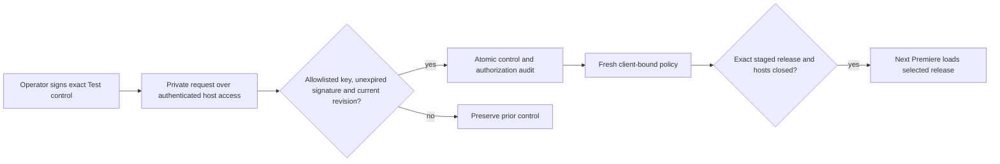

# Full-app updater replacement: isolated Test controls

The September 21 privileged updater experiment was rejected because its required
Settings enrollment does not meet the customer experience. Local rollback commit
`4dd084a` reverses implementation `77076c3` and documentation `aa2863f` / `5e7873f`.
The resulting source tree exactly matched canonical `origin/main`
`f8a5526bdf77acf2f49ef31fc73fad30a36acb72` before this documentation was added.
There are no deployed replacement updater API routes or enabled server keys/flags.
Do not recover the old routes as the replacement baseline.

## Boundaries and next gate

Website owns signed policy, immutable artifact delivery and operator controls.
FlowState owns CEP, native user companions, installers and local lifecycle health.
Its new clean checkout is `/Users/alexgarrett/.codex/worktrees/flowstate-user-updater-20260922`,
from canonical FlowState `55602785f6fa629a8a4f91f608d6a46c8ea4d93e`, subsequently
integrating canonical `e6905daec608c11bc18eb9d1b9a6891c95425a69` in reviewed local
merge `5175732`.
Read its `docs/user-updater.md` for the enrollment probe, Sparkle evaluation,
filesystem trust, migration and the complete validation gates.

September 23 Windows handoff: fresh Azure portal sign-in with MFA succeeded, but
the publisher identity is still Action Required and no certificate profiles
exist. Existing Microsoft support case `2609230010000211` remains Open. The
FlowState private employee baseline uses the ordinary isolated Windows Test
installer; it is not a Windows background-updater implementation or signed A-to-B
proof. Employee x64/Premiere testing and Microsoft signature verification remain
separate gates. No Website delivery route, release manifest or deployment changes
are implied by a locally prepared handoff.

The first gate requires a signed isolated Test A-to-B update: normal installation with
no required Settings step, background survival, held download with A usable,
exact signed approval, safe selection while Adobe hosts are closed, real Premiere
B load, rapid relaunch without mixed files and Adobe validation without debug mode.
Do not expand server implementation until this mechanism is measured. Apple user
LaunchAgent feasibility and an installed helper are insufficient evidence.

The September 22 signed native enrollment probe registered immediately as the
current Mac user with `requiresApproval=false` and an advancing background
heartbeat. No Settings action was taken, but prior publisher approvals on this
developer account prevent a clean-machine claim. The probe was unregistered
after testing. The later signed/notarized `mechanism-05` passed the Mac arm64 A-to-B gate: held B download while A 1.0.24 remained usable, host-open approval hold, normal closure, actual B 1.0.25 load with bridge ready, and two quick relaunches including an immediate offline relaunch. Adobe debug modes were 0. This is existing-account evidence, not clean-machine, Windows or x64 proof.

The v2 Test policy below separately names download and activation targets/cohorts,
binds exact immutable ID, full hash, scope and compatibility, expires approval,
prevents replay, supports hold/revocation and requires explicit exact rollback
authority. Operator history and policy revisions persist locally. Release/policy
trust roles remain separate; clients cannot choose destinations or commands.
An unavailable approval authority leaves the current verified app usable. Offline
revocation cannot be instantaneous; document the lease and final-commit race.

[Sparkle's delegate documentation](https://sparkle-project.org/documentation/api-reference/Protocols/SPUUpdaterDelegate.html)
does not make install-on-quit an approval barrier: returning either value from
the deferred-install callback still allows an install attempt on application exit.
Unapproved downloads must stay outside that install cycle. Companion self-update
also needs freshness enforcement at commit, not simply an approved feed response.

## Public-state and release boundary

Do not change `/api/releases/latest`, legacy `rolloutPercent`, `/api/download`,
paid pointers, checkout, entitlement, credits or attribution. No Website push,
deployment, public foundational installer or Production activation is authorized
by the replacement implementation request. Keep changes reviewable on local main.

September 22 live baseline: canonical Website version SHA `f8a5526`; public Mac
1.0.21 at 25%, Windows 1.0.16 at 100%. These are observations, not future guarantees.
Verify full exact manifests again at task end. Paid continuity remains blocked
until FlowState preserves original acquisition receipts and qualifies a separate
update-continuity chain without weakening existing receipt/activation checks.

Rollback evidence and private local snapshots are under
`/Users/alexgarrett/Documents/Codex/Plans/sidestream-user-updater-20260922`.
The old loopback service on 8894 was stopped after verifying its process ownership.
The old Mac service was unregistered; the reviewed signed maintenance package removed the installed app and shell
after Alex force-quit the stuck Mac host and the reopened empty instance quit
normally. Its store and older helper are preserved. None of this modifies hosted state.

After server work, run focused policy tests, existing release/rollout regressions,
API typecheck and build; retain the required entitlement and checkout contract
checks if those shared surfaces change. A later explicit release decision must
follow synchronized main-only Git deployment and verify canonical source and
checkout behavior. No direct Vercel deployment.


## Local mechanism proof authority

`scripts/user-update-proof-authority.mjs` is a standalone loopback-only authority
for the native FlowState mechanism proof. It creates separate Test Ed25519 release
and policy keys outside the repository, serves immutable local payload/manifest
files, and issues 60-second policies with durable increasing revisions. It has no
write HTTP endpoint, customer identities, deployed routes or Production keys.
Policy changes are explicit local operations. Activation must name both the exact
catalog release ID and archive hash; held download has no activation authority.

```sh
node scripts/user-update-proof-authority.mjs --keygen --state /private/proof-keys
node scripts/user-update-proof-authority.mjs --set --state /private/proof-keys --catalog /private/proof/catalog.json --download mechanism-01-b --activate hold
node scripts/user-update-proof-authority.mjs --serve --state /private/proof-keys --catalog /private/proof/catalog.json
node --test tests/user-update-proof.test.mjs
```

To approve, repeat `--set` with `--activate mechanism-01-b --activate-hash <exact
catalog SHA-256>`; download and activation stay separate. This local Test harness
is not the future authenticated remote operator UI or durable release database.
The narrow policy tests cover held download, exact approval, scope/revisions and
signature tampering. They do not establish native installation or Premiere proof.


## Durable Test protocol v2

`scripts/user-update-test-control.mjs` validates immutable targets, deterministic
independent download/activation cohorts, explicit exact rollback and revocation.
`scripts/user-update-test-server.mjs` provides the isolated operator CLI and
loopback-only service on `127.0.0.1:8896`. It has no HTTP mutation endpoint, deployed
API route, customer identity, Production key or connection to existing release
manifests. The retained v1 proof authority on 8895 remains unchanged for historical
reproduction. V2 uses scope `sidestream-user-release-test-2`.

Each client has a random local Test identifier represented as a SHA-256 string;
it is not an account, acquisition or hardware identity. Cohort assignment hashes
scope, operator salt and this identifier. Download and activation can name different
releases and percentages. Activation does not grant download access. A cached
release can activate while a different future release downloads. Companion download
and activation targets are separate again and require a companion-kind catalog item.

An operator prepares a private JSON control file with this shape (replace IDs and
hashes from the exact immutable catalog; no key values belong in this file):

```json
{
  "schema": "sidestream.user-control.v2",
  "download": {"id": "mechanism-06-b", "sha256": "<exact SHA-256>", "salt": "test-download", "percent": 100},
  "activate": null,
  "rollback": null,
  "revoked": [],
  "companion": null
}
```

Review/apply it with:

```sh
node scripts/user-update-test-server.mjs --set --state /private/test-keys --catalog /private/catalog.json --control /private/control.json
node scripts/user-update-test-server.mjs --serve --state /private/test-keys --catalog /private/catalog.json
node --test tests/user-update-proof.test.mjs tests/user-update-test-control.test.mjs
```

`--set` checks catalog bytes and hashes before persisting the control and append-only
operator history in one atomic file. History is bounded at 1,024 revisions and
requires explicit archiving when full. Operator and server lock files prevent
concurrent writers. A crashed process may leave a lock; verify that exact process
is absent before removing its task-owned stale lock. Do not bypass a live owner.

To approve a release, set `activate` to its exact ID/hash, cohort salt and percentage.
To hold, set `activate` to null. To revoke future download/activation, add the hash
to `revoked` and clear any target referencing it. To authorize rollback, name its
exact activation target and add `rollback: {"fromSha256":"<currently selected>",
"toSha256":"<approved target>"}`. The native high-water mark still prevents an
ordinary policy from replaying historical releases after rollback. Companion
controls use `companion: {"download": <choice or null>, "activate": <choice or null>}`.
They cannot change native keys or agent registration through policy.

Signed `/policy?client=<hash>` responses bind the client, complete targets,
monotonic durable revision and a 60-second lease. Signed `/delivery` responses
issue short-lived exact-target URLs only to the eligible download cohort. Range
requests require the matching strong hash ETag, exact start/end and a maximum
4 MiB range; malformed ranges, changed ETags, expired URLs and revoked artifacts
fail closed. Clients refresh a URL for each chunk and independently verify signed
inventories, prefix checkpoints and final hashes. A URL grant is never activation
authority. The native wrapper limits bytes, disk, rate, attempts and expensive
networks; server range behavior does not substitute for those limits.

The signed native builder can pin an explicit HTTPS authority; HTTP is permitted
only for exact Test loopback and redirects are refused. The service can remain a
loopback origin behind a separately reviewed TLS ingress, with remote operators
using authenticated host access for the CLI. No such ingress is deployed here.

The service is an implemented local Test surface with signed operator requests
(below), not a deployed remote dashboard or release database. Remote host access,
TLS ingress, durable database and key-management deployment
require a separately reviewed release decision. No policy becomes public merely
because a local candidate or test passes. Current native v2/self-update results
must be read from the evidence report separately from the proven v1 mechanism.

### Authenticated Test operator requests

`scripts/user-update-test-operator.mjs` signs an exact private control request with
an Ed25519 operator key separate from policy/release keys. The server's private
`operators-v2.json` is provisioned locally, never supplied by the request:

```json
{"schema":"sidestream.user-operators.v1","keys":[{"id":"<SHA-256 of public SPKI DER>","publicKey":"<Ed25519 public PEM>"}]}
```

The server accepts only those exact fingerprints, rejects service-signing keys,
and permits no request-driven key enrollment. The allowlist is same-user mode 0600
inside the existing mode-0700 state directory. Keep the private operator key on
the operator's machine, outside repositories and server artifact catalogs.

```sh
umask 077
node scripts/user-update-test-server.mjs --snapshot --state /private/test-keys --catalog /private/catalog.json > /private/control-snapshot.json
node scripts/user-update-test-operator.mjs --key /private/operator.pem --snapshot /private/control-snapshot.json --control /private/control.json --out /private/request.json
node scripts/user-update-test-server.mjs --set-request --state /private/test-keys --catalog /private/catalog.json --request /private/request.json
node --test tests/user-update-test-operator.test.mjs
```

Snapshot retrieval and application can run through an existing authenticated SSH
session. This change adds no SSH account, firewall rule, public listener or HTTP
mutation. Requests bind Test scope, exact targets/cohorts, a random nonce, the
previous control digest/revision and a maximum five-minute signature lifetime.
The request lifetime authorizes the control write; the resulting control remains
in force until a subsequent hold/revocation, with fresh 60-second client policies.
Under the existing operator lock, application rejects stale or replayed requests,
revalidates immutable catalog bytes, then atomically persists the control and its
authorization audit. A later local hold also advances the revision, so an earlier
signed approval cannot undo it. Local `--set` remains explicit host-owner authority.
Do not reset the revision when archiving bounded history.



Tests cover forged/unknown keys, modified hashes, scope and field injection,
expiry, revision conflicts, nonce reuse, local holds, concurrent writers and real
sign/apply CLI execution. A local signed hold was also applied against the exact
mechanism-07 catalog; targets stayed held and the installed updater stayed disabled.
This is authenticated local command evidence, not a remote TLS/SSH deployment.

The signed native mechanism-06 loaded A with its bridge ready and Adobe debug
modes 0, then resumed a held B download from 19 verified chunks after an authority
outage and OS helper restart. A native companion-publication defect was reproduced
and corrected with a real extraction regression. The corrected signed companion-09
then passed actual v2 A-to-B, explicit rollback to A and restore to B, with matching
fresh loaded-version/root/bridge evidence and debug modes 0. Exact approval held
while the host was open; normal closure activated B even while an independently
approved companion download remained incomplete. The sequence high-water mark
survived rollback. Shell repair and helper survival through host closure passed.

Companion-10 downloaded and verified while activation stayed held, then exact
approval remained blocked until normal host closure. The first whole-root app
exchange could not launch the new build because macOS resolved the retained old
bundle. Safe recovery restored the previous signed agent with B unchanged.
FlowState's subsequent correction preserves the registered outer app directory
and observes post-swap authorization from the installed image. Signed build 5→6 subsequently passed the held download, host-open approval hold,
normal closure, complete contents exchange and acknowledgment by a new OS-launched
registered agent. The installed signature remained valid and the selected CEP
release was unchanged. Offline actual panel loading and idempotent explicit
disablement passed; final maintenance records are retained in the private report.
Earlier storage/menu blockers were resolved; they are historical failed attempts,
not the current qualification status. No remote deployment or customer migration
is authorized by these Test results.

At the earlier checkpoint, native explicit disable/uninstall checks passed, including repeated
disablement, no re-enrollment on an actual panel load, store-preserving uninstall,
and preservation of the older helper. One disabled/offline rapid relaunch produced
fresh A/bridge evidence but a black panel capture, so its visible-render result is
not passed. The next retry stopped at Premiere's startup recovery dialog before
CEP loaded; the empty process was force-quit under Alex's explicit instruction.
The Test app/shell/service were then uninstalled, their store/archive retained,
all operator targets held, and the loopback authority stopped. This does
not establish clean-machine, Windows, customer migration or paid-continuity proof.

## Continuation on integrated source

Under the continued Test authorization, the exact signed companion-12 build 6 was
reinstalled with its earlier disabled store preserved separately. Its original A
rendered online/enabled and twice offline/disabled, with fresh matching bridge
health, visible green footer and no service re-enrollment. The second repeat
followed measured normal all-host closure and immediate relaunch. No rendering
code changed; the earlier black capture has not reproduced and its cause is not
established.

Fresh `mechanism-07` is signed/notarized from clean FlowState
`e44f1a19c8df3eba154286ba1f9d2ca663117dba`, including reviewed current main. It
uses native build 7 (0.3.4), A 1.0.26 and B 1.0.27, with new immutable hashes.
The builder refuses dirty source before creating output and accepts explicit
versions/builds. Exact artifacts and further real Premiere evidence are recorded
in the private `continuation` evidence folder. This is still isolated Test.

Current readiness evidence locates Windows SDK 10.0.26100.0 SignTool and NSIS in
the ARM64 VM. Azure has a cached enabled account; that does not prove current
Artifact Signing authorization. No .NET SDK or Windows x64 machine is available
in that VM. Existing Windows Premiere PID 9980 and its project were preserved.
Mac account `sidestreamtest` exists but has no graphical session; credentials
were not created, changed or bypassed. Login/reboot and clean-account qualification
remain separate gates.

Read-only Mac inventory found existing duplicate Production and Test CEP
identities across system/user roots. Their manifests and the system acquisition
receipt were hashed and preserved. The unique updater Test identity did not
replace any of them. Actual customer migration and paid update continuity remain
unqualified; a Test local-Unlimited proof cannot satisfy paid receipt validation.

Fresh `mechanism-07` subsequently passed the actual signed Mac update: A 1.0.26
searched while complete B 1.0.27 downloaded held; exact approval was observed with
hosts open while A stayed selected. Normal closure selected B and preserved the
original helper PID. Actual B visibly loaded with matching root/bridge evidence
offline, then again after deliberate disablement and a rapid normal relaunch.
Adobe debug modes were 0 throughout those proofs and restored afterward. The new
Test installation remains available but disabled/unregistered; the local authority
is stopped and all targets are held. No public pointer or remote deployment changed.
The exact native source is unchanged from the earlier measured companion self-update.
