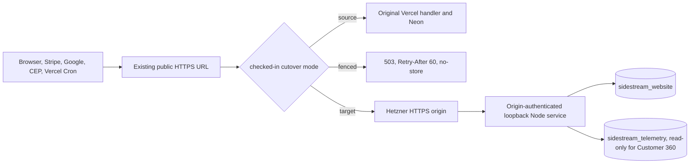

# Hetzner production database cutover

## Current architecture and cutover states

The public sites stay on Vercel. PostgreSQL never leaves the Hetzner host: the
Vercel middleware either runs the original Vercel handler, fences the API, or
rewrites the existing HTTPS path to a loopback-only Node service behind nginx.
The state is a reviewed source-code constant so each transition has a Git SHA
and a Git-linked Production deployment.

Website mode is `DATABASE_CUTOVER_MODE` in `middleware.ts`; alexg.mov owns an
independent constant with the same name. `source` removes forged internal
headers and preserves Vercel behavior. `fenced` rejects every `/api/*` request,
including scheduled jobs, so no unclassified database writer can bypass the
cutover. `target` requires an HTTPS base path and a 32-512 character origin
secret, preserves the path/query, and fails closed to the fence if configuration
is invalid.

The intended services are `sidestream-website-api.service` on `127.0.0.1:3101`
and `sidestream-alexg-api.service` on `127.0.0.1:3102`. nginx exposes only HTTPS
base paths on the server's existing reverse-DNS hostname. PostgreSQL remains on
`127.0.0.1:5432` and `[::1]:5432`; port 5432 is never opened in the host or
provider firewall.

## Complete writer inventory

All Website rows use the pooled URL selected by `api/_lib/postgres.ts`. Customer
360 usage sync additionally reads the separate telemetry database through
`SIDESTREAM_TELEMETRY_POSTGRES_URL`. All rows below are fenced together by the
Website `/api/*` middleware matcher.

| Website writer | Public/runtime entry | Failure and retry behavior | Target route |
| --- | --- | --- | --- |
| Google account/session and logout | `/api/auth/google/*`, `/api/auth/session`, `/api/auth/logout`; Vercel functions | Authentication/account writes fail non-2xx; a browser can retry the operation | Same URL to Website service |
| Checkout intent/session/completion and billing | `/api/checkout/*`, `/api/billing/*`; Vercel functions | Database or provider failure is non-success; locked intents and Stripe idempotency make retries safe | Same URL to Website service |
| Stripe receipt and entitlement queue | `/api/stripe/webhook`, `/api/internal/stripe-events/process`; Stripe plus five-minute Vercel Cron | Webhook success follows durable queue insertion; Stripe retries non-2xx and the cron leases/retries persisted events | Same URLs to Website service |
| Activation, account device, license credentials | `/api/activation/*`, `/api/account/device`, `/api/license/*`; browsers and installed clients | Database failure is non-success; credential/claim writes use transactional uniqueness and CAS rules; clients retain credentials on transient 5xx | Same URLs to Website service |
| Acquisition and install claims | `/api/acquisition/*`, `/api/installation/*`, `/api/paid-acquisition/*`; browser/installer flows | Canonical claims are transactional/idempotent; optional attribution writes may be best effort and are explicitly reported | Same URLs to Website service |
| Download leads and delivery handoff | `/api/download-lead`, `/api/send-download-links`, `/api/internal/download-leads/replay`; browser plus ten-minute Cron | Idempotency keys and deterministic fallback records protect retries; replay advances only after the database commit | Same URLs to Website service |
| Installer/referral observations | `/api/download`, `/api/referral-visit`; browser and download clients | Privacy-limited observations are best effort and do not block the artifact; callers do not promise a database retry | Same URLs to Website service |
| Credits and rate limits | `/api/credits/*` plus rate-limited account/checkout routes | Wallet/reservation/ledger changes are transactional; transient errors are non-success | Same URLs to Website service |
| Maintenance | `/api/internal/maintenance`; daily Vercel Cron | Bounded/idempotent maintenance; failed runs retry on the next schedule or protected manual invocation | Same URL to Website service |
| Customer 360 usage materialization | `/api/internal/customer-usage/sync`; daily Vercel Cron | Reads telemetry with a dedicated read-only credential, writes Website checkpoints/aggregates transactionally, and retries from its high-water mark | Same URL to Website service, local telemetry read |
| Human-only Customer 360 reads/reports | `/api/internal/customers/*`, `/api/internal/customer-summary`, `/api/internal/upgrade-pricing-report` | Read-only but fenced because they depend on database consistency | Same URLs to Website service |
| Manual repository operators | migration, reconciliation, support, and audit scripts | Not scheduled services; they must not run during the fence unless explicitly listed in the cutover record | Protected direct local tooling only |

alexg.mov uses `lib/postgres-db.js`; these routes are all covered by its own
`/api/*` middleware fence and target rewrite.

| alexg.mov writer | Public/runtime entry | Failure and retry behavior | Target route |
| --- | --- | --- | --- |
| Raw telemetry plus install/session rollups | `/api/plugin-telemetry`; old CEP and installer clients | One transaction records deduplicated raw events and rollups. Only full persistence returns 200; 503 leaves the client's bounded queue for retry | Same public URL to alexg service |
| Checkout snapshot | `/api/create-checkout`; browser | Stripe Session creation is authoritative; ledger capture is idempotent but historically best effort, so a failed ledger observation does not create a second charge | Same URL to alexg service |
| Stripe commerce and fulfillment | `/api/webhook`; Stripe | Signature-verified events, checkout state, fulfillment, and terminal status must be durable before 2xx. Failure returns retryable 503. Resend uses the Checkout Session idempotency key, and fulfilled purchases are locked/deduplicated | Same URL to alexg service |
| Leads | `/api/email-capture`; browser | Resend Contacts, Stripe customer, and Postgres are independent stores; success requires at least one configured durable store | Same URL to alexg service |
| Download audit | `/api/download`; browser | The artifact path remains primary; database audit writes are best effort and do not block delivery | Same URL to alexg service |
| Rollups | Inline in `/api/plugin-telemetry` | No separate cron, queue, or server timer; raw event and rollups commit or roll back together | Local transaction |

Local JSONL page analytics is not PostgreSQL data and is outside this database
transfer. Server inspection found no additional app cron, queue, or systemd
writer before the cutover services are installed.

## Database and credential design

`sidestream_website` and `sidestream_telemetry` stay separate. Each has a
no-login owner plus distinct SCRAM login roles for application, backup, and
verification. The telemetry database also has a separate read-only Customer 360
role. Application roles receive only connect, schema usage, required table DML,
sequence usage, and function execution; verifier and Customer 360 roles are
read-only. They receive no superuser, role creation, database creation, schema
creation, replication, or ownership capability. Source browser roles and RLS
policies remain present only as no-login compatibility roles with the same
restrictions.

Credential files belong to root or the service account, are mode 0600, and are
never passed in command arguments. Backup/evidence directories are timestamped,
root-owned, and mode 0700.

## Transfer, fence, and verification gates

Neon has `wal_level=replica` and logical replication is disabled, so the
documented fallback is a custom-format direct-source dump while the selected
application is fenced. Long read-only snapshots and dumps use Neon's direct
non-pooler endpoint; the transaction pooler rejects the verifier's read-only
startup session option. Rehearsal dumps/restores can run live and are expected
to show row drift; they are never accepted as final copies.

For one database at a time:

1. Rehearse direct dump, restore, roles, service, and read-only verifier.
2. Deploy and attest the source-mode routing SHA and prepared target service.
3. Deploy `fenced`, record the UTC start, and prove the public API is returning
   retryable 503 before taking the final dump.
4. Restore into a freshly recreated final target; do not mutate source rows or
   apply/baseline pending migrations.
5. Require complete source-to-target parity: catalog, tables, row counts,
   content fingerprints, migrations/checksums, sequences, RLS/policies,
   ownership/grants, exposed roles, and target security.
6. Back up the final local target, restore it into a fresh independent
   restore-check database, and require the same complete verifier PASS.
7. Deploy `target`, attest the Production SHA, origin authentication, loopback
   database identity, public API behavior, and natural target writes.
8. Prove the matching Neon checkpoint no longer advances. Stabilize the first
   database before fencing the second.

Website license/device hashing currently falls back to the normalized selected
database URL when no explicit `SIDESTREAM_LICENSE_HASH_SECRET` exists. The
one-time encrypted export captures those exact normalized bytes as an explicit
secret and an HMAC continuity proof without printing them. Before Production
traffic moves, the Hetzner runtime must reproduce the proof. After stabilization
the old Neon application password is rotated/revoked so the retained identity
key is no longer an active database credential; Neon rollback receives a new,
separately protected credential.

## Rollback boundaries and backups

Before the first accepted Hetzner write, rollback is: keep or redeploy the
fence, confirm Neon was the last sole writer, then redeploy the attested
`source` SHA. Never open both paths.

After any accepted Hetzner write, a route reversal is forbidden. Fence Hetzner,
copy the complete current Hetzner state to a fresh Neon target (or prove an exact
delta), restore-check and verify it completely, and only then route writes back.

Retain the direct-Neon custom dumps, final local-target backups, restore lists,
checksums, verifier reports, and sanitized runtime/security evidence under the
timestamped server backup/evidence directories. Neon projects and data are kept
intact; removing Neon from active traffic does not authorize deletion.
