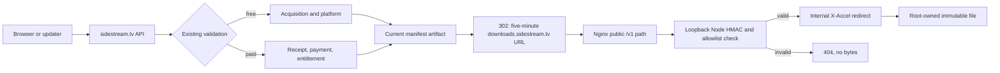

# Installer delivery: Hetzner production runbook

## Contract

The public entrypoints do not change:

- Free Mac: `https://sidestream.tv/api/download`
- Free Windows: `https://sidestream.tv/api/download?platform=win32-x64`
- Receipt-gated Unlimited: `/api/paid-acquisition/artifact`
- Update metadata: `/api/releases/latest` and `/api/releases/paid-latest`
- Mobile emails keep linking to the same Sidestream routes.

Only the final byte host changes. Acquisition, referral, receipt/payment, entitlement, manifest, update, and platform validation all remain ahead of the storage redirect.



The HMAC input is the exact immutable pathname plus expiry under a versioned context. It contains no user, email, license, receipt, payment, or acquisition identity. The validator admits only the four artifacts selected by the current free and paid manifests, rejects non-canonical or traversal-shaped paths, and caps the authorization lifetime at five minutes plus 30 seconds of clock tolerance. Node authorizes; Nginx serves bytes with Range support.

## Runtime configuration

Set the same generated 32-byte-or-longer `SIDESTREAM_DOWNLOAD_SIGNING_SECRET` on the Website execution environment and Hetzner. Never put it in Git, shell history, a URL, or logs.

Hetzner `/etc/sidestream/website-runtime.json` remains root-owned mode `0600` and adds:

```json
{
  "SIDESTREAM_INSTALLER_PROVIDER": "blob",
  "SIDESTREAM_ARTIFACT_ROOT": "/srv/sidestream/artifacts",
  "SIDESTREAM_DOWNLOAD_SIGNING_SECRET": "<protected random value>"
}
```

Start with `blob`. The last cutover step changes it to `hetzner`. Keep Blob credentials because referral, limiter, fallback, and replay records still use `@vercel/blob`.

## Artifact set

The target layout is `/srv/sidestream/artifacts/<manifest pathname>`. Directories are root-owned `0555`; final files are root-owned `0444`; `.incoming` is root-only `0700`. A file is finalized only after exact size and SHA-256 verification, and a different payload can never overwrite an existing pathname.

| Role | Immutable pathname | Bytes | SHA-256 |
| --- | --- | ---: | --- |
| Active free Mac | `sidestream/1.0.19/Sidestream-1.0.19-Mac-Installer.dmg` | 227135707 | `c3beeec06b7ba3c636d224f92c42a1a2c293916be2da5f227c95cb85c6c81c56` |
| Active free Windows | `sidestream/1.0.16/Sidestream-1.0.16-Windows-Installer.exe` | 61707154 | `28647d18cc3f44f44e6c5d82d689430cf0ef7802e43677a7c41b36a37a719bb0` |
| Active paid Mac | `sidestream/1.0.17/e941f79f7332e9b7/Sidestream-1.0.17-Unlimited-Mac-Installer.dmg` | 226542501 | `e941f79f7332e9b70c8b63f200275eb56f1ed14f15fee7177fafef51f43d6121` |
| Active paid Windows | `sidestream/1.0.13/Sidestream-Unlimited.exe` | 61653939 | `9ab3a9e2fd84d41d9468be184c85081355fe93ab726a33ed62b9c47a32d443ad` |
| Free Mac rollback | `sidestream/1.0.18/Sidestream-1.0.18-Mac-Installer.dmg` | 226516361 | `e7ba552c2d5d104d6109171cc1092bf7db1a2d566e7750d29c48b84e02a94ba4` |
| Free Windows rollback | `sidestream/1.0.13/Sidestream-1.0.13-Windows-Beta-Installer.exe` | 61653939 | `9ab3a9e2fd84d41d9468be184c85081355fe93ab726a33ed62b9c47a32d443ad` |
| Paid Mac behavior rollback | `sidestream/1.0.17/Sidestream-1.0.17-Mac-Installer.dmg` | 226540711 | `7189d55af4afdad9ee4d3188117d782dd1869690b735ac388e448fcb6aa106e3` |

The paid Windows active file is also its preserved current rollback source. Before cutover, run `scripts/copy-blob-artifact-to-hetzner.mjs` once per row and then `scripts/finalize-hetzner-artifact.mjs --verify-only` for every row. A single mismatch blocks the cutover.

For every future installer, upload before changing a manifest:

```bash
npm run release:upload-hetzner -- \
  --artifact /absolute/path/to/installer \
  --pathname sidestream/<version>/<filename>

npm run release:publish-manifest -- \
  --platform macos \
  --version <version> \
  --artifact /absolute/path/to/installer \
  --pathname sidestream/<version>/<filename> \
  --signed --verified --smoke-tested --provider hetzner
```

The publish command independently asks the remote finalizer to verify exact pathname, size, and SHA before it writes the manifest.

## DNS, TLS, and Nginx

1. Record the authoritative DNS state and current `downloads.sidestream.tv` lookup.
2. Add one GoDaddy `A` record: host `downloads`, value `2.29.9.121`, normal/default TTL. Do not add an `AAAA` record until IPv6 is deliberately configured and tested.
3. Install `ops/nginx/sidestream-download-limits.conf` under `/etc/nginx/conf.d/`.
4. Install the bootstrap site, create `/var/www/certbot`, enable it, and require `nginx -t` before reload.
5. After public DNS resolves to the server, issue the certificate with Certbot webroot for `downloads.sidestream.tv`.
6. Replace the bootstrap site with `ops/nginx/downloads.sidestream.tv.conf`, require `nginx -t`, and reload.
7. Prove automatic renewal with `certbot renew --dry-run`.

Only `/v1/` is public. `/__sidestream_artifacts/` is Nginx `internal`; requesting it directly must return `404`. Directory listing is off. The transfer log contains time, OS class, status, byte count, duration, Range, and upstream duration only. It deliberately omits client IP, query strings, signatures, and full paths. Per-client request and connection limits plus a 12 MiB/s per-transfer ceiling reduce obvious scraping without serializing normal installers.

## Same-SHA deployment and cutover

1. Capture the Vercel Blob/CDN Usage baseline and a ranged/full Blob performance baseline before the provider switch.
2. Complete repository tests, commit on synchronized `main`, and push only `main:main`.
3. Wait until `https://sidestream.tv/version.json` reports that exact pushed SHA. A Ready Preview is not proof.
4. Fast-forward `/srv/sidestream/website-backend` to the same SHA, build `.server-dist`, set `SIDESTREAM_DEPLOYED_SHA`, and restart `sidestream-website.service` while provider remains `blob`.
5. Confirm the local and public Hetzner health payloads report that exact SHA and `installerProvider=blob`.
6. Stage all artifact bytes and Nginx/TLS. Use a locally generated valid signed URL against the real download host to prove `HEAD`, `206` one-byte Range, full download SHA, and all negative cases before switching public signing.
7. Run the provider operator without apply. It hashes all four active files:

   ```bash
   node scripts/set-installer-provider.mjs --provider hetzner
   ```

8. Apply only after every preceding check passes:

   ```bash
   node scripts/set-installer-provider.mjs \
     --provider hetzner \
     --apply-provider=hetzner
   ```

9. Re-run the complete live matrix through `sidestream.tv`. Confirm every free and paid redirect uses `https://downloads.sidestream.tv/v1/`, while updater manifests, mobile emails, attribution writes, and receipt/entitlement checks remain unchanged.

## Required live security and delivery matrix

- Valid Mac and Windows free flows: correct `302`, `HEAD`, one-byte `206`, complete file size, complete SHA-256.
- Valid authorized paid Mac and Windows flows: receipt/payment/entitlement still required, followed by the same byte checks.
- Updater compatibility: both release endpoints retain the public contract and installed clients can fetch the selected artifact.
- Missing signature, changed signature, expired URL, duplicated query field, changed pathname, unknown artifact, encoded traversal, doubled slash, direct internal path, and unsupported method: no installer bytes.
- A signed URL stops working after expiry; it does not contain identity.
- Nginx Range response includes the expected `Content-Range`, `Content-Length`, attachment filename, and stable SHA-based ETag.
- Acquisition/referral evidence is created only at the existing successful redirect boundary, not by rejected download-host requests.
- Nginx logs contain no IP, query, signature, receipt, email, license, or payment data.

## Rollback to Blob

Do not delete or rename Blob installer objects for at least 14 days. Rollback changes provider selection only; manifests and public Sidestream URLs stay unchanged.

```bash
cd /srv/sidestream/website-backend
node scripts/set-installer-provider.mjs --provider blob
node scripts/set-installer-provider.mjs \
  --provider blob \
  --apply-provider=blob
```

The first command verifies all four active Blob objects and makes no change. The second writes a mode-`0600` runtime snapshot, atomically changes the provider, restarts the service, and requires healthy `installerProvider=blob`. If Vercel execution can serve API handlers directly, set its `SIDESTREAM_INSTALLER_PROVIDER=blob` too and wait for the Git-linked deployment of the same SHA. Existing Hetzner links expire within five minutes; keep Nginx and the artifacts online for at least ten minutes after rollback. Then verify free, paid, updater, mobile-email, and attribution flows again. DNS removal is a separate later cleanup and is never part of emergency rollback.

## Fourteen-day validation

Capture these at the same time daily for days 0-14:

- Vercel Blob/CDN transfer and operation totals versus the pre-cutover baseline.
- Nginx status counts, bytes by OS class, Range count, p50/p95 duration, and rejected-request count.
- Artifact filesystem usage and free disk space.
- Nginx and Website service CPU, memory, restarts, open connections, and recent errors.
- One free ranged probe per OS and one bounded authorized paid probe without polluting acquisition reporting.
- A full Mac and Windows performance sample on day 0, day 1, day 7, and day 14 from the same test location; record DNS, connect, TLS, first-byte, total time, throughput, size, and SHA.

Rollback immediately for hash/size drift, cross-platform delivery, entitlement bypass, repeat 5xx/timeout errors, disk pressure, unstable service restarts, or materially worse performance that is not explained by the test network. Do not call reduced Vercel usage a success until Nginx transfer evidence and end-to-end downloads reconcile.
