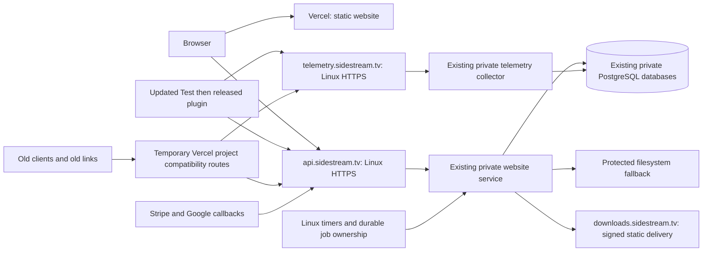

# Direct Linux backend migration

## Status: blocked before activation

Audit: September 8, 2026 PDT (September 9 UTC). This is an operational plan,
not a deployed migration. No runtime, DNS, provider destination, scheduler,
database, client endpoint, or Blob record was changed during this audit.
The existing telemetry templates remain inactive and have not passed server
`nginx -t`. Do not switch client defaults to either proposed hostname yet.

The configured `sidestream-server` alias targets `sidestream-dev@2.29.9.121`
with `~/.ssh/sidestream_hetzner_ed25519`. A fresh noninteractive connection
failed with `Permission denied (publickey,password)`. The agent lists only the
GitHub key. Authenticated Linux execution is required to attest services,
prepare protected configuration, qualify ingress, and move jobs/storage.
Do not request, print, or store a private-key passphrase. Access restoration
must make the existing authorized server identity usable; do not create a
new access path or reset the server as a workaround.

## Verified baseline and limits of evidence

| Surface | Observation | Verdict |
| --- | --- | --- |
| Website source/public version | Clean synchronized main and canonical `/version.json` both reported `e34ca946f0af6eba5de704b4e16dc39b53782ad9` before this documentation change | Pass |
| New API and telemetry DNS | Local resolver could not resolve `api.sidestream.tv` or `telemetry.sidestream.tv`; neither endpoint is qualified | Blocked |
| Installer DNS/TLS | `downloads.sidestream.tv` resolved to `2.29.9.121`; certificate-verified HTTPS answered from Nginx | Pass |
| Public Mac installer | HEAD 200; bytes 0–15 returned 206; unsigned path 404; streamed 225,362,072 bytes, SHA-256 `c7f553f5c4bca0a7314e4f40ff50ac7feb3fd55c5e9eb14657fab54f5cdb26e9` matched public manifest | Pass |
| Public Windows installer | HEAD 200; bytes 0–15 returned 206; unsigned path 404; streamed 61,707,154 bytes, SHA-256 `28647d18cc3f44f44e6c5d82d689430cf0ef7802e43677a7c41b36a37a719bb0` matched public manifest | Pass |
| Browser session/checkout smoke | Session GET 200, `authenticated:false`; Checkout GET 302 to canonical Google start route | Pass for signed-out smoke only |
| Real sign-in, paid receipts, activation, entitlements | No authenticated end-to-end migration test performed | Blocked |
| Stripe provider configuration | Live dashboard: active `sidestream-site`, endpoint `we_1TpKypDFKjeGlioXZNxWQAgN`, `https://sidestream.tv/api/stripe/webhook`, 13 event types, displayed 0% error rate | Pass for current configuration only |
| Cron provider configuration | Live Vercel settings: Enabled; all five routes/schedules below matched source | Pass for current configuration; Linux handover blocked |
| Legacy telemetry | GET returned expected 405; public Linux analytics health reported `live`, `postgres`, `production`, successful refresh at `2026-09-09T04:26:13.672Z` | Partial baseline only |
| Fresh event persistence/deduplication | Bounded recent-events read timed out; no synthetic event was submitted without a working read-back proof | Blocked |
| Database/service exposure | External probes could not reach ports 5432, 3101, or 3102 | Pass for external reachability only; loopback binding needs SSH |
| Neon isolation | Reopened provider settings: public internet OFF, VPC OFF, logical replication not enabled; retained project/branches present | Pass |
| Backend service SHA/configuration | SSH authentication failed; frontend SHA is not backend SHA | Blocked |

The analytics rendered page was accessible, but its initial visible snapshot
was older than the later health response. Neither proves that a new test event
was persisted or that natural events continued after an ingress change.
Paid installer authorization, tampered/expired signatures, and direct-ingress
CORS/TLS still require the qualification matrix below.

## Architecture and ownership

This is the target. Currently website API, provider callbacks, cron requests,
and legacy telemetry still enter through Vercel. Only installer bytes are
proven direct by this audit.

- **Sidestream Website** owns API/auth/payment logic, database migrations,
  static browser callers, release manifests, ingress and Linux job operations.
  Use `README.md` File Map and Routes for the full handler inventory.
- **alexg.mov** owns the existing collector (`api/plugin-telemetry.js`,
  `lib/postgres-db.js`) and legacy update compatibility handler. Its checkout
  contains unrelated edits, including telemetry, on
  `codex/update-travel-aug-2026`; do not deploy or merge it wholesale. No
  repository-root `AGENTS.md` was present during inspection.
- **FlowState** owns logger/updater/account/credit clients, native installers,
  and analytics. Its `codex/after-effects-test-host` checkout also contains
  unrelated changes. Keep Test-first release policy and both mandatory package
  preparations after any code edit; no production plugin release is authorized
  by preparing this migration.
- **Provider configuration** is independent evidence: DNS, Google OAuth,
  Stripe, Vercel project routes/schedules, Linux services/certificates and
  filesystem ownership all need live read-back after changes.

Use direct, sequential main-only changes here. Orchestra live runs create
worktrees/integration branches and conflict with this repository's canonical
main rules; no Orchestra plan or dashboard was started for this audit.

## Runtime dependency inventory

| Responsibility | Current source / configuration | Migration requirement |
| --- | --- | --- |
| API forwarding/execution | `middleware.ts`, `server/hetzner-api.ts`; origin-authenticated existing loopback service intended at 3101 | New narrow TLS ingress; attest actual unit, SHA, runtime file, route coverage first |
| Accounts, OAuth, licensing, credits | `api/_lib/account.ts`, `api/auth/*`, `api/account/*`, `api/license/*`, `api/activation/*`, `api/credits/*` | Preserve session/token/hash keys, exact environment separation and transaction behavior |
| Checkout/fulfillment | `api/checkout/*`, `api/billing/*`, `api/stripe/webhook.ts`, Stripe queue helpers | Keep raw signed bodies, locked intents, event uniqueness, zero-total paid and `no_payment_required` validation |
| Acquisition and paid landing | `middleware.ts`, `api/acquisition/*`, `api/installation/*`, `api/paid-acquisition/*` | Move signing, first-touch assignment and dynamic landing decisions to Linux too; moving `/api/*` alone does not make Vercel frontend-only |
| Installers/metadata | `api/download.ts`, `api/_lib/installer-delivery.ts`, `api/releases/*`, `data/release-manifest*.json` | Keep all free/paid manifest identities, signed authorization, internal Nginx serving, immutable bytes and rollout state |
| Referral storage/reporting | `api/_lib/referral-visits.ts`, `scripts/report-referral-visits.mjs` | Replace create-only Blob object per source/day/classification/hash and update report reader together |
| Mobile limiter | `api/_lib/download-lead-blob.ts`, `api/send-download-links.ts` | Preserve CAS increments, shared email/IP window counts, expiry, retry bounds and fail-closed behavior |
| Lead fallback/replay | Same Blob helper, `api/download-lead.ts`, `api/internal/download-leads/replay.ts` | Preserve deterministic merge, receipt identity, byte bounds and delete only after committed DB write plus unchanged source version |
| Existing database-backed lead storage | `api/_lib/download-leads.ts`, `api/_lib/rate-limit.ts` | Reuse existing canonical `(email, cta_source)` and transactional limits; verify deployed schema before extending |
| Collector and dashboard | alexg collector; FlowState analytics service | Preserve single-transaction event/rollup deduplication, strict acknowledgements, privacy and Production/Test separation |
| Other portfolio commerce | alexg checkout, webhook, LUT Blob delivery and email capture | Preserve unrelated products/services; classify any Sidestream legacy calls before altering shared routes |

Blob remains an active dependency. Imports also remain in installer rollback
and seeding tooling. Do not uninstall `@vercel/blob` while these paths exist.
Vercel storage UI showed retained private stores `sidestream-release-105` and
`products`; this audit did not enumerate/export customer records.

### Credentials and callback inventory

No credential values belong in source, reports, frontend bundles or plugin
payloads. Current Linux presence/values remain unverified until SSH works.

| Configuration | Required handling |
| --- | --- |
| `SIDESTREAM_ORIGIN_AUTH_SECRET`, `SIDESTREAM_HETZNER_ORIGIN_URL` | Existing middleware trust boundary; public Nginx must strip forged headers and inject the server-side secret locally |
| Website Postgres selector; `SIDESTREAM_TELEMETRY_POSTGRES_URL` | Existing private website role and separate read-only telemetry role; attest selected host/database without exposing URL/password |
| Session/license/acquisition/HMAC/encryption secrets | Preserve exact bytes and versions; no implicit fallback to a changed database URL or hostname |
| `SIDESTREAM_BASE_URL`, `PUBLIC_BASE_URL`, `GOOGLE_REDIRECT_URI` | Currently shared URL helper affects browser pages, OAuth and links; separate frontend and API origins before switching |
| Google client ID/secret | Existing Google integration; register direct callback while retaining legacy callback during handover; actual Google console allowlist remains unverified |
| Stripe API key and webhook signing secret | Keep account, mode, API version, enabled events and destination identity; never assume a newly created endpoint has the old secret |
| `CRON_SECRET` and runtime enable flags | Read from protected local configuration; never command-line arguments, client payloads, or public unprotected cron routes |
| `BLOB_READ_WRITE_TOKEN` and any store-specific token | Retain through export/reconciliation and rollback window; do not revoke before every consumer migrates |
| Resend key/sender settings | Existing delivery service; retain stable idempotency keys across timeout/retry and scheduler handover |
| Installer signing secret/root/provider | Preserve manifest-bound signatures, immutable storage and internal-only file location |

## Phases, acceptance and rollback gates

### 0. Attest and back up — infrastructure owner

Restore authorized SSH; inventory active unit files, executable roots and SHAs,
Nginx version/config paths, certificate renewal mechanism, listeners/firewall,
timers/crontabs, runtime variable names and database migration ledger. Inspect
values only locally where necessary, with sanitized evidence. Back up relevant
configs and current data using existing protected backup procedures; prove a
restore into an isolated local target without touching retained Neon.
Record Vercel route revisions, DNS records/TTL, cron enable state, Stripe
destination configuration and Google callback allowlist. No traffic switch
until this baseline is complete. Access failure ends activation work here.

### 1. Qualify direct telemetry — Website ops + portfolio collector

Follow `direct-telemetry-ingress.md`: reuse 3102, validate Nginx before reload,
publish DNS directly to the attested Linux address, obtain valid TLS and verify
renewal. Admit only POST/OPTIONS `/v1/events`, bounded 512 KiB bodies and retryable
rate limiting; drop forged origin/forwarding/auth headers. Keep databases and
services private. Preserve the recovery bridge until direct qualification.

Require unique operator event read-back, duplicate ID with exactly one stored
event/rollup effect, strict persistence acknowledgement, malformed/oversize
rejection, CORS, unavailable-upstream behavior using an isolated fixture, and
fresh natural event arrivals. Then change only the exact legacy project route
to the direct ingress, remove its deployment-specific target/bypass dependency,
and reprove legacy POST behavior. Do not redirect old clients.

Rollback: restore saved project route revision and last-working Nginx config;
validate and gracefully reload. Never delete a hostname already used by clients.

### 2. Direct application ingress and browser continuity — Website

Prepare an explicit public route allowlist from the README's API map, including
all client-used dynamic routes. Keep `/api/internal/*` and health/admin paths
private. Preserve route-specific methods, body limits, raw Stripe bytes,
timeouts and no-cache responses. Forward cookies, content type, idempotency and
authorization headers where required; normalize trusted host/protocol/IP at
Nginx and remove alternate spoofable forwarding headers. Existing origin auth
stays enabled on the Node listener. Never inject cron/admin bearer credentials
into a general public proxy.

Browser implementation must precede URL changes:

1. Separate API origin from frontend return/link origin. `getBaseUrl` currently
   serves several roles; changing only `SIDESTREAM_BASE_URL` is insufficient.
2. Keep HttpOnly, Secure, host-only sessions. Existing `sidestream.tv` cookies
   cannot be read by `api.sidestream.tv`. Implement a short-lived, single-use,
   server-stored session transfer bound to an API browser challenge and an
   allowlisted continuation, using a top-level POST handover so session
   credentials never enter URLs. Reject replay, expired challenges, login CSRF
   and mismatched browser state; preserve the existing session on failure.
   Transfer acquisition/receipt continuity through separately validated opaque
   state, without exposing identity in browser JavaScript.
3. New browser fetches use the direct API with `credentials: include`; respond
   with exact allowlisted frontend origin, credential permission and `Vary:
   Origin`. Never use wildcard or arbitrary reflection. Preflights have bounded
   methods/headers. Cross-origin permission does not replace CSRF validation.
4. Keep strict JSON mutation checks and exact trusted browser Origin checks;
   reject untrusted/null origins for cookie-authorized mutations. Plugin bearer
   flows retain their existing distinct authorization rules.
5. OAuth start and callback must share the API origin. Register direct Google
   callback first, retain the old callback for in-flight states, keep safe
   return paths, and verify state cookies, account access, logout, paid-through
   access, billing, checkout and activation in a real browser.

Run focused auth/CORS/session-transfer/CSRF tests, `npm run
verify:checkout-contract`, `npm run test:entitlement`, and frontend/API builds.
Test signed-out, existing signed-in and newly signed-in browsers, expired state,
hostile origin, replay, Free-to-Unlimited, More Credits, zero-total Checkout,
account restore, device limits and paid receipt recovery. Real provider-backed
results are required in addition to fixtures; do not charge customers to test.

Rollback: return browser callers to old compatibility ingress backed by the
same Linux database; keep both callback paths and valid sessions operational.
No database reversal or Neon reconnection.

### 3. Move operational Blob records — Website storage

Use PostgreSQL for normal canonical records and atomic counters. Preserve a
protected filesystem fallback independent of PostgreSQL availability for lead
capture and any limiter needed during DB outage: replacing a DB-failure fallback
with the same unavailable DB is not equivalent behavior. Use bounded per-key
cross-process locking, exclusive creation, durable atomic replace, version
checks, private permissions, quota monitoring and bounded replay. Never use
process-local memory or an unlocked read/overwrite for rate limiting.

Export only relevant prefixes into protected staging with pathname, source
version/ETag, size and checksum. Reconcile object counts and payload hashes,
canonical dedupe keys, first/last timestamps and replay receipts. Import is
resumable/idempotent; invalid or oversized records are quarantined for review.
Preserve daily referral hashes/classification and exact email/IP window counters
and expiry. Do not reset an active window during cutover.

Use a bounded writer handover with an explicit selected backend and final delta
reconciliation. Failed mandatory persistence returns retryable non-success;
never acknowledge/drop records to make the cutover appear successful. Retain
old objects, immutable import receipts and backups through validation. Reconcile
new Linux records before any storage rollback; simply selecting old Blob would
lose post-cutover updates. Retire active Blob reads/writes only after concurrent
increment, retry, crash, expiry, replay-after-commit, unchanged-version deletion
and DB-unavailability tests pass. Remove tokens/dependency only after rollback
consumers are separately retired.

### 4. Scheduled job ownership — Website ops

| Existing route | UTC schedule (source and provider verified) | Existing safeguard to retain |
| --- | --- | --- |
| `/api/internal/stripe-events/process` | Every 5 minutes | Durable event queue; 25-row batch; 10-minute leases |
| `/api/internal/download-leads/replay` | Every 10 minutes | Committed canonical write/receipt before version-checked deletion |
| `/api/internal/maintenance` | 04:13 daily | Advisory lock and bounded retention |
| `/api/internal/customer-usage/sync` | 05:27 daily | Durable usage checkpoints and idempotent aggregation |
| `/api/internal/annual-renewal-reminders` | Minute 17 every 6 hours | Enable flag, leases and stable renewal email idempotency |

Use existing Linux systemd timers with explicit UTC schedules, protected local
requests and durable execution records. Add a database-owned scheduler epoch
and per-job/due-slot claims checked by both old and new invocations before side
effects. Host-local `flock` alone cannot exclude Vercel. Retain job-level locks
and provider idempotency; exactly-once external effects require stable provider
keys, not merely a scheduler lock. Persist last successful due slot and retry
state so downtime catches up without losing scheduled work.

Install timers disabled; test against isolated fixtures. Pause Vercel globally,
record final accepted run and drain active leases. Atomically select Linux
ownership, enable timers, and reconcile missed due slots. Prove simultaneous
old/new attempts, process crash, timeout, lease expiry and reboot cannot double
fulfill or skip outstanding work. Keep Vercel configuration until all five jobs
have successful Linux execution evidence and the global switch is verified OFF.

Rollback: stop Linux acceptance/timers, drain claims, change ownership epoch,
then re-enable Vercel. Never enable both without shared ownership enforcement.

### 5. Provider callbacks — Website payments

Qualify signature validation at direct Linux ingress with exact raw bodies and
the existing queue. Preserve Stripe account/mode/API version and all 13 enabled
event types. Prefer changing the existing destination URL after qualification
and attesting its signing configuration; creating a second endpoint requires
explicitly distinct secret validation and durable event-ID dedupe. Reconcile
provider deliveries against queue receipts/outcomes before and after switch.
Keep the legacy callback route for retries and in-flight deliveries. Verify
valid/invalid signatures, repeated events, out-of-order lifecycle events,
zero-total paid sessions, email idempotency and no duplicate entitlement.

Rollback: restore the saved provider URL; retain the same Linux queue/database,
event IDs and last-working signature verifier. Do not replay all events blindly.

### 6. Clients, compatibility and frontend-only cleanup — all owners

FlowState logger currently defaults to `https://alexg.mov/api/plugin-telemetry`;
updater uses `https://sidestream.tv/api/releases/latest`; native installer embeds
the old telemetry URL and `https://sidestream.tv` account origin. Inventory
remaining account, credit, activation, install claim and dashboard callers
before edits. Keep overrides and Test isolation; Test installer telemetry is
currently disabled by default. Preserve the user's existing logger changes.

Change Test defaults only after direct ingress passes; run focused contracts,
`npm run package:prep:test` and `npm run package:prep`, then prove the loaded
Test panel, actual upload, installer receipt and analytics refresh. Production
publication requires the explicit Test-to-Production release step.

Old hardcoded `sidestream.tv/api/*`, `alexg.mov/api/plugin-telemetry` and legacy
`alexg.mov/api/sidestream/releases/latest` must keep direct successful responses.
The oldest updater does not follow redirects and has a release-notes mapping
contract: preserve its response adapter on Linux before moving that route.
DNS cannot route a single URL path. Temporary Vercel **project-level** exact
compatibility rules are therefore required; they must target stable Linux
HTTPS, never a retained deployment. Keep forwarding headers necessary for
legacy OAuth/session semantics explicitly trusted and bounded.

Move middleware acquisition signing, paid landing decisions, legacy response
adapters and operational tasks before removing Vercel backend bundles/secrets.
Verify a static-only frontend deployment leaves direct APIs and old-client
compatibility working. Remove each obsolete dependency only after its
replacement and rollback have passed. Public API release manifests must still
match immutable installer metadata and staged rollout gates.

## Completion and rollback record

Record timestamps, frontend and service SHAs, DNS answers, certificate identity,
Nginx validation, provider configuration, unique event read-back/dedup counts,
natural arrival window, auth/payment results, all four free/paid artifact gates,
job ownership/runs, Blob reconciliation and Neon isolation in a sanitized
release record. Never use frontend `version.json`, an HTTP acknowledgement,
Vercel Ready, or a prepared configuration as proof of these other surfaces.

Current outcome: **activation blocked by Linux authentication**; browser,
storage and scheduler implementation/qualification remain outstanding. All
existing Vercel backend dependencies listed above remain. No operational
rollback is needed for this documentation-only audit. Future rollback restores
ingress/provider/scheduler ownership against the existing Linux databases;
Neon stays disconnected and retained backups/databases are never deleted.
